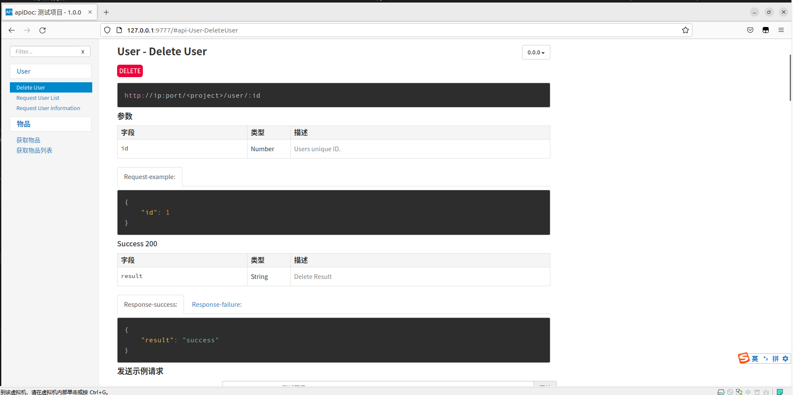
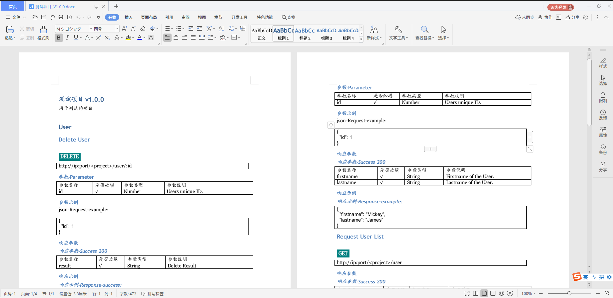
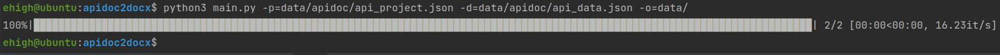

# apidoc to docx

## generate apidoc data

> Use node's apidoc tool to generate JSON data
> 
> Use the apidoc-markdown tool to generate markdown files

### install


+ Global Installation
  ```shell
  npm i apidoc@0.26.0 -g
  npm i apidoc-markdown@6.0.0 -g
  ```
  > If you are using Linux and cannot install it, try adding sudo

+ Local Installation
  ```shell
  cd data/
  npm i
  ```

### usage

+ generate interface comments
  ```php
  /**
   * @api {get} /goods 获取物品列表
   * @apiName 获取物品列表
   * @apiGroup 物品
   *
   * @apiSuccess  {Object[]} goods 物品列表
   * @apiSuccess {String} goods.name 物品名称
   * @apiSuccess {Number} goods.size 物品大小
   * @apiSuccessExample {json}  响应示例:
   * [{"name": "铅笔", "size": 1},{"name": "流星", "size": 9999999999}]
   */
  function get_goods()
  {
  }
  ```
  
  [good.php](data/good.php)

+ generate apidoc
  ```shell
  cd data/
  apidoc -i project/ -o apidoc/
  # You can also use the optional -f to specify the interface file
  apidoc -f project/good.php -o apidoc/
  ```
  > You can access it through a browser, provided you provide an HTTP service to the generated directory
  > 
  > If you have PHP environment, you can use php -S ip:port to start a HTTP service
  
  

+ generate markdown
  
  Apidoc-markdown will help you generate markdown files
  
  ```shell
  cd data/
  # Use optional -p to specify apidoc directory
  apidoc-markdown -p apidoc/ -o doc.md
  ```
  [doc.md](doc.md)

+ most importantly

  If you want to set the project information, you need to add an apidoc.json file

  ```json
  {
    "name": "project name",
    "version": "project version",
    "description": "project description",
    "url": "project prefix url"
  }
  ```
  [apidoc.json](data/apidoc.json)

## Generate docx based on apidoc

Some Markdown programs can export to PDF or Word, but these programs can be slow and invisible

So this tool helps you generate docx files and has a progress bar that looks good, so let's see how it works!

+ Please use python3

+ Install requirements

  ```shell
  pip3 install -r requirements.txt
  ```

+ generate docx
  ```shell
  python3 main.py -p=data/apidoc/api_project.json -d=data/apidoc/api_data.json -o=data/
  ```
  
  Bingo, now you can get a docx [file](data/测试项目_V1.0.0.docx)~

  

  And, isn't this progress bar nice?
  
  

  I'll go first. It's so comfortable

### Last

Maybe I should wrap python-docx~
  
